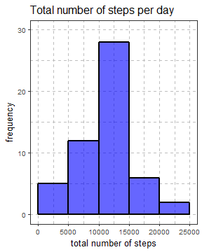
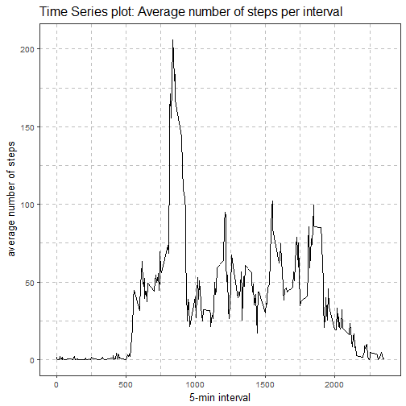
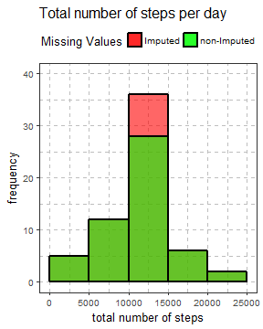
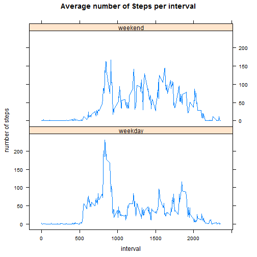

## Reproducible Research -- week 2 peer Assignment 
### Loading and preprocessing the data


Reading the data

```r
if(!file.exists("activity.zip")) {
        temp <- tempfile()
        download.file("http://d396qusza40orc.cloudfront.net/repdata%2Fdata%2Factivity.zip",temp) 
        unzip(temp)
        unlink(temp)
}

data <- read.csv("activity.csv")
```
### What is mean total number of steps taken per day?
Histogram of the total number of steps taken each day summarizing the total number of steps per day and calulating the mean and median.  

summarize total number of steps per day and plot the Histogram

```r
## optional for this step to omit NAs
## for sum it is not needed to ignore NAs, for mean it would have been
o.data <- na.omit(data)   
data.per.date <- group_by(o.data, date)
data.sum <- summarize(data.per.date, steps = sum(steps))  

## plot histogram with ggplot2
g <- ggplot(data.sum, aes(x = steps)) + 
        geom_histogram( binwidth = 5000, boundary = 5000, color = "black", alpha = .6, fill = "blue", size = 0.8) +
        labs(x = "total number of steps", y= "frequency") +
        labs(title = "Total number of steps per day") +
        coord_cartesian(ylim= c(0,30)) +
        theme_bw( base_size = 13) +
        theme(panel.grid.major =   element_line(colour = "grey",size=0.3, linetype = 2)) +
        theme(panel.grid.minor =   element_line(colour = "grey",size=0.3, linetype = 2))
print(g)
```



```r
## calculate mean and median
mean_steps <- mean(data.sum$steps, na.rm = T)
median_steps <- median(data.sum$steps, na.rm = T)
```
The average number of steps is 1.0766189 &times; 10<sup>4</sup> and the median number of steps is 10765

### What is the average daily activity pattern?
Calculate the average number of steps per interval for all days and plot the resulting histogram.

```r
m.data <- aggregate(steps ~ interval, data, mean)
ggplot( m.data, aes(x= interval, y=steps)) +
        geom_line(linetype = 1) +
        labs(x = "5-min interval", y = "average number of steps", title = "Time Series plot: Average number of steps per interval") +
        theme_bw( base_size = 13) +
        theme(panel.grid.major =  element_line(colour = "grey", size = 0.3, linetype = 2)) +
        theme(panel.grid.minor =  element_line(colour = "grey", size = 0.3, linetype = 2))
```



```r
i_max_steps <- m.data[which.max(m.data$steps),1]
```
The interval with the maximum number of steps is 835

### Imputing missing values  
The number of missing values was calculated and the Missing values of an interval were imputed by inserting the average number of steps for the corresponding interval. Finally the mean and median were calculated.

```r
sum(!complete.cases(data))
```

```
## [1] 2304
```

```r
## Split
s.data <- split(data, data$interval, drop = FALSE)

## Apply to a list
replace_nas <- function(x) {
        x[!complete.cases(x),1] <-  mean(x[,1], na.rm = TRUE)
        return(x)
}

a.data <- lapply( s.data, replace_nas )


## Combine
c.data <- do.call("rbind", a.data)
c.data$steps <- as.integer(c.data$steps)


## summatize
total_steps_by_day <- aggregate(steps ~ date, c.data, sum)

i.data <- transform(total_steps_by_day, Case = "Imputed")
ni.data <- transform(data.sum, Case = "non-Imputed")

sum.data <- rbind(ni.data, i.data)

g <- ggplot(sum.data, aes(x = steps, fill=Case)) + 
        geom_histogram( data =subset(sum.data, Case == 'Imputed'), aes(fill=Case), binwidth = 5000, boundary = 5000, color = "black", alpha = .6,  size = 0.8) +
        geom_histogram( data =subset(sum.data, Case == 'non-Imputed'), aes(fill=Case), binwidth = 5000, boundary = 5000, color = "black", alpha = .6,  size = 0.8) +
        scale_fill_manual("Missing Values", values = c("Imputed" = alpha("red", 0.6), "non-Imputed" = alpha("green", 0.6))) +
        labs( x = "total number of steps", y= "frequency") +
        labs( title = "Total number of steps per day") +
        coord_cartesian( ylim= c(0,40)) +
        theme_bw( base_size = 13) +
        theme( legend.position = "top") +
        theme( panel.grid.major =   element_line(colour = "grey", size=0.3, linetype = 2)) +
        theme( panel.grid.minor =   element_line(colour = "grey", size=0.3, linetype = 2)) 
print(g)
```



```r
## calculate mean and median
mean_steps_i <- mean(i.data$steps, na.rm = T)
median_steps_i <- median(i.data$steps, na.rm = T)
```
The average number of steps for the imputed data is 1.074977 &times; 10<sup>4</sup> and the median number of steps is 10641. 

### Are there differences in activity patterns between weekdays and weekends?
Summarize and plot the average number of steps per interval for weekdays and weekends seperately. The resuling plots indicate that during weekends the overall activities tend to be higher although a peak appears during the weekdays.

```r
t.data <- transform( c.data, weekDay =  weekdays( as.Date( i.data$date )) )
t.data <- transform( t.data, day = ifelse( as.character(weekDay) %in% c("Samstag","Sonntag"), "weekend", "weekday"))
weekend.data <- aggregate(steps ~ interval, subset(t.data, day == "weekend"), mean)
weekend.data <- transform( weekend.data, day = "weekend")

weekday.data <- aggregate(steps ~ interval, subset(t.data, day == "weekday"), mean)
weekday.data <- transform( weekday.data, day = "weekday")
w.data <- rbind( weekday.data, weekend.data)

with(w.data, xyplot(steps~interval|day, type = "l", layout = c(1,2), xlab = "interval", ylab = "number of steps", main = "Average number of Steps per interval"))
```




